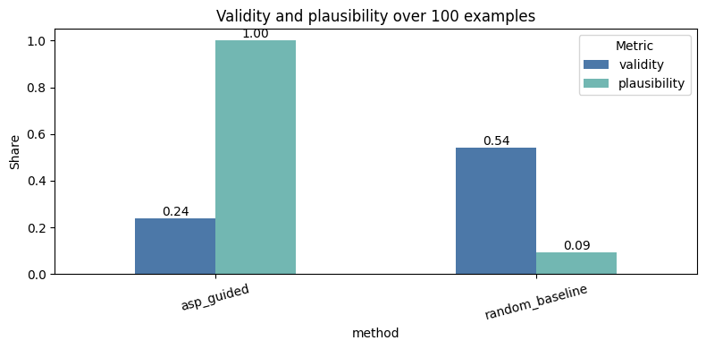
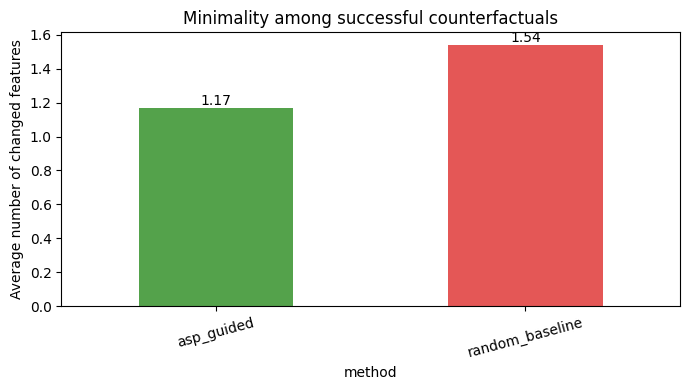
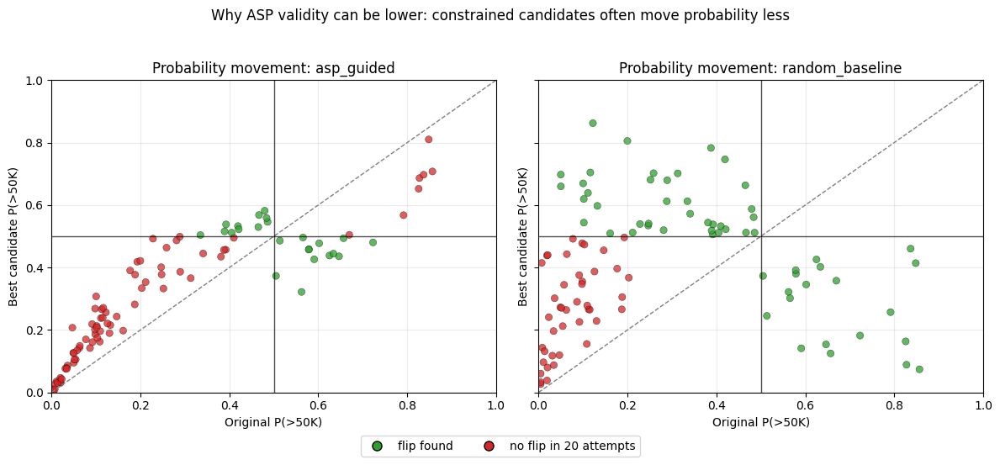
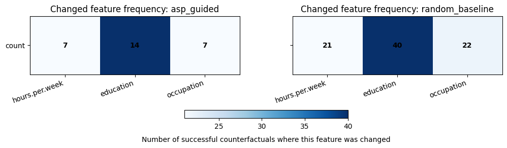

# PACE: A Neuro-Symbolic Framework for Plausible and Actionable Counterfactual Explanations
---
## Overview

PACE (**Plausible and Actionable Counterfactual Explanations**) is a neuro-symbolic framework that combines machine learning and Answer Set Programming (ASP) to generate realistic, feasible, and actionable counterfactual explanations.

The project investigates whether symbolic reasoning can improve the quality of counterfactual explanations by enforcing domain knowledge and plausibility constraints during the search process.

---

## Research Problem

Counterfactual explanations answer the question:

> *"What minimal changes would be required for a machine learning model to produce a different decision?"*

Although many existing approaches successfully flip model predictions, they frequently generate explanations that:

- violate domain constraints;
- modify immutable attributes;
- produce unrealistic feature combinations;
- lack practical actionability.

PACE addresses these limitations by integrating symbolic reasoning directly into the counterfactual generation process.

---

## Key Contributions

✅ Integration of Machine Learning and ASP

✅ Explicit domain constraints and plausibility rules

✅ Actionable counterfactual generation

✅ Comparison against unconstrained random search

✅ Reproducible experimental pipeline

---

## Framework Architecture

```text
Input Instance
       │
       ▼
MLP Classifier
       │
       ▼
Desired Prediction
       │
       ▼
ASP Knowledge Base
       │
       ▼
Counterfactual Search
       │
       ▼
Validation
       │
       ▼
Final Explanation
```

---

## Dataset

The framework is evaluated using the **Adult Income Dataset**.

Prediction task:

```text
Income > 50K USD
vs
Income ≤ 50K USD
```

Selected editable features:

- Education
- Occupation
- Hours-per-week

ASP constraints define:

- editable attributes;
- immutable attributes;
- valid feature transitions;
- plausibility requirements.

---

## Repository Structure

```text
PACE/
│
├── README.md
│
├── notebooks/
│   └── neurosymbolic_counterfactuals.ipynb
│
├── asp/
│   ├── rules.asp
│
├── results/
│   └── figures/

```
---

# Experimental Results

## Validity and Plausibility Comparison



The ASP-guided approach achieves perfect plausibility while maintaining competitive validity.

---

## Minimality Comparison



ASP-generated explanations require fewer feature modifications on average.

---

## Probability Movement Analysis



The symbolic constraints guide the search toward realistic and feasible solutions.

---

## Feature Modification Frequency



Feature modification patterns reveal how symbolic constraints influence explanation generation.

---

# Main Findings

Compared to random search, the ASP-guided approach demonstrates:

- higher plausibility;
- better adherence to domain constraints;
- improved interpretability;
- reduced number of feature modifications;
- more actionable recommendations.

---

# Future Work

Potential future extensions include:

- larger ASP knowledge bases;
- multi-objective optimization;
- adversarial robustness constraints;
- explainable intrusion detection systems (X-IDS);
- evaluation on cybersecurity datasets.

---

# Author

**Pavel Iakovets**

Master's Programme:
Cybersecurity and AI

University of Klagenfurt

Austria

---

# License

This repository is intended for educational and research purposes.

---
# Citation
@misc{iakovetspavel,
  title={PACE: A Neuro-Symbolic Framework for Plausible and Actionable Counterfactual Explanations},
  author={Iakovets, Pavel},
  year={2026}
}
